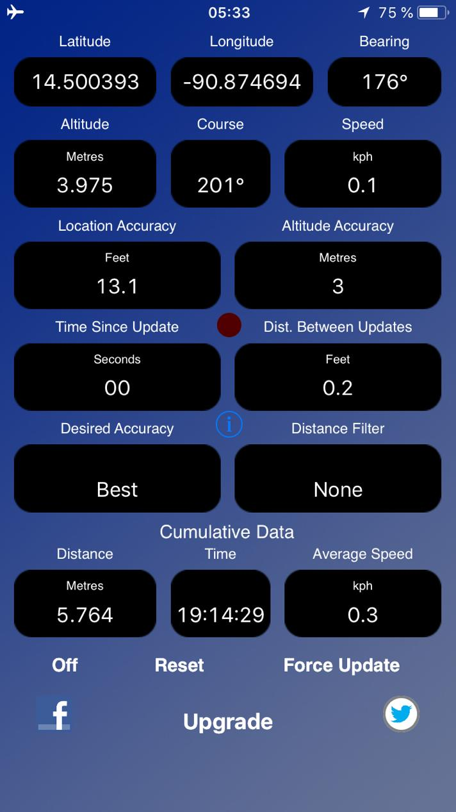

# location24

Simple Android App to display the location based on GPS data.

My old iPhone 7 (and 5S before that) had a simple GPS location app on it. That's how the user interface looks like:

No interrupting ads, just the plain information. I liked it to fast get the information of the height that I am at - on the Acatenango like in this example or when on a plane or hiking in general. It should be possible to create something similar in Kotlin for Android.

That's at least the idea. I have a developer account for Android since 2015. Let's use it!
